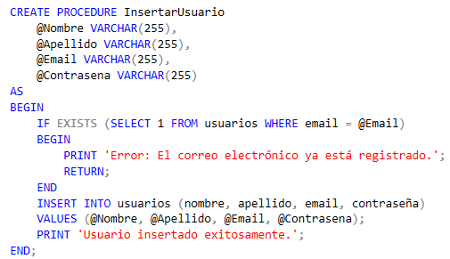
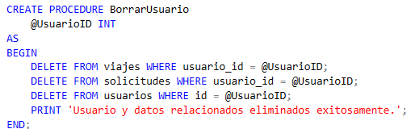
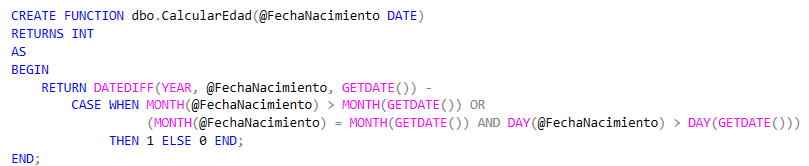
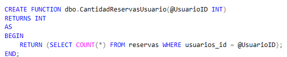
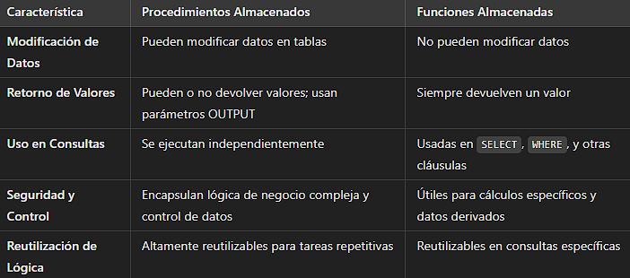

# Proyecto de Estudio

### Desarrollo de una aplicación de viajes compartidos: `Viajate`

**Asignatura**: Bases de Datos I (Facultad de Ciencias Exactas y Naturales - Universidad Nacional del Nordeste)

**Integrantes**:
- **Huici, Cesar Raúl**
- **Barrios, Emilio Farid**
- **Leiva, Francisco Emanuel**
- **Gauto, Diego Ignacio**

**Año**: 2024

---

## ÍNDICE

1. [Introducción](#introducción)
2. [Marco Conceptual o Referencial](#marco-conceptual-o-referencial)
3. [Metodología Seguida](#metodología-seguida)
4. [Desarrollo del Tema / Presentación de Resultados](#desarrollo-del-tema--presentación-de-resultados)
5. [Conclusiones](#conclusiones)
6. [Bibliografía](#bibliografía)

---

## CAPÍTULO I: INTRODUCCIÓN

### Tema
Este proyecto se enfoca en el desarrollo de **Viajate**, una aplicación para la organización de viajes compartidos. Su objetivo es conectar a personas que desean compartir trayectos en sus vehículos particulares, optimizando recursos y reduciendo costos y emisiones de carbono.

### Definición o Planteamiento del Problema
El problema identificado es la falta de una plataforma centralizada que permita a los usuarios coordinar viajes compartidos de manera eficiente y segura. Esto genera inconvenientes como altos costos de transporte, mayor congestión vehicular y un impacto ambiental significativo debido al uso individual de vehículos. **Viajate** busca resolver estos problemas proporcionando una solución que reduzca los costos de transporte y las emisiones de gases de efecto invernadero.

### Objetivos
- **Objetivo General**: Crear una plataforma de viajes compartidos que facilite la conexión entre usuarios que buscan compartir trayectos similares.
- **Objetivos Específicos**:
  - Desarrollar un backend robusto que permita la gestión de usuarios, viajes y solicitudes.
  - Optimizar la base de datos para un almacenamiento eficiente y seguro de la información.
  - Implementar funcionalidades que faciliten la creación y gestión de viajes compartidos.
  - Mejorar una base de datos ya creada en la aplicacion.

---

## CAPÍTULO II: MARCO CONCEPTUAL O REFERENCIAL

El desarrollo de Viajate como un sistema de gestión de viajes compartidos requiere la implementación de funcionalidades esenciales que garantizan la eficiencia, seguridad y adaptabilidad del sistema a las diversas necesidades de sus usuarios. Al ser una plataforma destinada a coordinar trayectos compartidos, Viajate debe ofrecer un diseño robusto que permita el manejo seguro de información personal, la optimización de consultas para un acceso ágil a los datos, y la flexibilidad necesaria para adaptarse a diferentes patrones de uso. A continuación, se presentan los aspectos clave que guían su diseño.

1. **Manejo de Json en sql**: Importancia de reducir el uso individual de vehículos y promover opciones compartidas.
2. **Permisos y Roles**: Conceptos clave para el diseño de bases de datos eficientes y seguras.
3. **Optimizacion de consultas atraves de indices**: Metodologías y buenas prácticas para el diseño de APIs RESTful con Golang.
4. **TEMA 2: PROCEDIMIENTOS Y FUNCIONES ALMACENADAS**:
La implementación de procedimientos y funciones almacenadas en Viajate es fundamental para mantener una plataforma eficiente, segura y capaz de manejar operaciones complejas de manera estructurada. Estas herramientas permiten encapsular la lógica de negocio directamente en la base de datos, lo cual facilita la gestión de transacciones, reduce el margen de error en las operaciones y asegura la consistencia de los datos.

Procedimientos Almacenados en Viajate
Los procedimientos almacenados en SQL Server son conjuntos de instrucciones SQL que se guardan y ejecutan en el servidor. En Viajate, los procedimientos almacenados se utilizan para gestionar operaciones clave que requieren un control riguroso, como la creación y eliminación de usuarios, la gestión de reservas y la administración de viajes. Estos procedimientos permiten que todas las operaciones se realicen de forma segura y eficiente, al reducir la interacción directa con las tablas y centralizar la lógica de negocio.

Ventajas de los Procedimientos Almacenados
Optimización del Tráfico de Red: Al ejecutar la lógica de negocio en el servidor, los procedimientos almacenados minimizan el tráfico de datos entre el cliente y la base de datos, mejorando el rendimiento de la plataforma.
Seguridad y Control: Los procedimientos almacenados limitan el acceso directo a las tablas de la base de datos, permitiendo que los usuarios ejecuten acciones específicas sin exponer la estructura interna de los datos.
Reutilización de Código: Los procedimientos pueden ser reutilizados en distintas áreas de la aplicación, lo que asegura la consistencia y facilita el mantenimiento de la lógica.
Mantenimiento Simplificado: Las actualizaciones en la lógica se realizan directamente en el procedimiento, sin requerir modificaciones en el código del cliente.
Rendimiento Mejorado: Los procedimientos almacenados se compilan una vez y pueden reutilizar su plan de ejecución, optimizando el rendimiento en consultas repetitivas.
Ejemplo en Viajate
InsertarUsuario: Este procedimiento permite registrar un nuevo usuario en la base de datos, validando previamente que el correo electrónico sea único para evitar duplicados.

BorrarUsuario: Este procedimiento elimina un usuario y todos los datos relacionados, como reservas y solicitudes, asegurando que no queden registros huérfanos.

Funciones Almacenadas en Viajate
Las funciones almacenadas permiten realizar cálculos específicos y retornar un valor que puede ser utilizado directamente en consultas SQL. En Viajate, las funciones son útiles para realizar operaciones como el cálculo de la edad de un usuario, la cantidad de reservas realizadas o el costo promedio de los viajes de un conductor. Estas funciones ayudan a reducir la carga en el cliente, permitiendo que cálculos complejos se realicen directamente en la base de datos.

Ventajas de las Funciones en Viajate
Cálculos y Consultas Personalizadas: Las funciones permiten realizar cálculos específicos dentro de las consultas SQL, lo cual es útil para generar estadísticas y personalizar la información.
Reutilización de Lógica: Al encapsular cálculos en funciones, se pueden reutilizar de manera uniforme en toda la base de datos, manteniendo la coherencia en los resultados.
Facilidad de Uso en Consultas: Las funciones pueden ser usadas en cláusulas SELECT, WHERE, entre otras, permitiendo integrarlas en diversas consultas de manera sencilla.

Ejemplo en Viajate
CalcularEdad: Calcula la edad de un usuario a partir de su fecha de nacimiento, lo cual es útil para obtener datos demográficos en la aplicación.

CantidadReservasUsuario: Cuenta el número de reservas realizadas por un usuario, proporcionando un dato estadístico relevante para su perfil.

Esta función devuelve la edad del usuario, lo que puede ser útil en diversas consultas y cálculos sin necesidad de realizar operaciones adicionales en el frontend.

Comparación entre Procedimientos y Funciones

---

## CAPÍTULO III: METODOLOGÍA SEGUIDA

### Descripción de cómo se realizó el Trabajo Práctico
El desarrollo de la plataforma **Viajate** se centró en el diseño y creación del backend utilizando Golang como lenguaje de programación y MySQL como sistema de gestión de bases de datos. Se trabajó en diferentes fases:

1. **Definición de Requisitos**: Identificación de las necesidades de los usuarios y las funcionalidades clave que debía cubrir la plataforma.
2. **Diseño de la Arquitectura**: Estructuración del sistema mediante el uso de una base de datos relacional con MySQL y la creación de APIs RESTful con Golang.
3. **Desarrollo del Backend**: Implementación de funcionalidades clave como el registro de usuarios, creación de viajes y mensajería interna.

### Herramientas Utilizadas
- **Golang**: Lenguaje de programación eficiente para la creación de APIs.
- **MySQL**: Sistema de gestión de bases de datos relacional.
- **Postman**: Herramienta para probar y documentar las APIs desarrolladas.
- **Cursos en línea y ChatGPT**: Fuentes de conocimiento que permitieron adquirir las habilidades necesarias para el desarrollo del backend, complementando con ejemplos y asistencia técnica.
- **Google Forms**: Herramienta utilizada para realizar encuestas y recopilar datos de usuarios potenciales sobre sus necesidades de movilidad.

---

## CAPÍTULO IV: DESARROLLO DEL TEMA / PRESENTACIÓN DE RESULTADOS

### Optimización de Consultas en la Base de Datos

#### Descripción del Conjunto de Datos
Se trabajó con la tabla `viajes`, diseñada para almacenar información clave sobre los viajes compartidos en **Viajate**. Las columnas principales incluyen `usuarios_id`, `vehiculo_id`, `origen`, `destino`, `fecha`, `hora`, `precio` y `asientos_disponibles`.

#### Carga Masiva de Datos
Para realizar pruebas de rendimiento y optimización, se realizó una carga masiva de un millón de registros en la tabla `viajes`, con datos generados de manera secuencial y aleatoria. Este proceso permitió obtener un conjunto de datos adecuado para medir la eficiencia de las consultas.

#### Evaluación Inicial de la Consulta sin Índices
Se realizó una consulta inicial en la tabla `viajes` sin índices, buscando registros entre el 1 de enero y el 31 de marzo de 2024. El plan de ejecución mostró un *Clustered Index Scan*, con un tiempo de respuesta de aproximadamente 0.247 segundos, lo cual sirvió como punto de referencia.

#### Implementación de Índices

- **Índice Agrupado en la Columna `fecha`**: Al crear un índice agrupado en la columna `fecha`, el plan de ejecución cambió a un *Clustered Index Seek* y el tiempo de respuesta mejoró a 0.156 segundos. Esto demostró la efectividad de un índice en la optimización de consultas por rango de fechas.
  
- **Índice Agrupado con Múltiples Columnas**: Para optimizar aún más, se añadió un índice agrupado en las columnas `fecha`, `origen`, `destino`, `hora`, `precio` y `asientos_disponibles`. Esto permitió reducir el tiempo de respuesta a 0.150 segundos y facilitó el acceso a múltiples columnas en una única consulta.

#### Comparación de Rendimiento
Al comparar los tiempos de respuesta entre las consultas en tablas con y sin índices, se observó una mejora significativa en el tiempo de ejecución al utilizar índices agrupados, en especial en consultas sobre grandes volúmenes de datos.

#### Impacto en `Viajate`
Estas optimizaciones en la base de datos resultan fundamentales para **Viajate**, ya que permiten una experiencia de usuario más fluida, con consultas y búsquedas rápidas en una plataforma que maneja grandes volúmenes de información de viajes compartidos.

---

### Procedimientos y Funciones Almacenadas en `Viajate`

#### Procedimientos Almacenados
Los procedimientos almacenados en **Viajate** agrupan instrucciones SQL que ejecutan operaciones CRUD (Crear, Leer, Actualizar y Borrar) de manera controlada y eficiente, encapsulando la lógica de negocio en el servidor. A continuación, algunos ejemplos clave:

- **InsertarUsuario**: Valida la unicidad del correo antes de registrar un nuevo usuario, asegurando la integridad de los datos.
- **ModificarUsuario**: Permite actualizar la información de un usuario tras verificar su existencia, evitando modificaciones no válidas.
- **BorrarUsuario**: Elimina un usuario y sus datos dependientes, garantizando la consistencia de la base de datos al borrar en cascada.

**Ventajas de los Procedimientos Almacenados**:
- Mejoran el rendimiento al ejecutar la lógica en el servidor, reduciendo la carga en el cliente.
- Aumentan la seguridad al limitar el acceso directo a las tablas.
- Facilitan el mantenimiento al centralizar la lógica de negocio en un solo lugar.

#### Funciones Almacenadas
Las funciones almacenadas devuelven valores específicos y son útiles para cálculos en consultas SQL, permitiendo realizar operaciones complejas sin duplicar código en varias consultas. Ejemplos de funciones utilizadas en **Viajate** incluyen:

- **CalcularEdad**: Calcula la edad de un usuario, útil en reportes demográficos.
- **CantidadReservasUsuario**: Cuenta las reservas realizadas por un usuario, ideal para estadísticas de uso.
- **PrecioPromedioViajesUsuario**: Calcula el precio promedio de los viajes realizados por un usuario.

**Ventajas de las Funciones Almacenadas**:
- Permiten cálculos reutilizables en consultas SQL, mejorando la eficiencia del código.
- Ejecución directa en SQL, lo cual optimiza el rendimiento.
- Simplifican los filtrados y cálculos personalizados en consultas complejas.

#### Impacto en `Viajate`
La combinación de procedimientos y funciones almacenadas en **Viajate** mejora la eficiencia, seguridad y mantenibilidad del sistema. Estos elementos permiten una gestión de datos robusta, optimizada para consultas y reportes, lo cual es esencial en una plataforma que requiere de operaciones rápidas y seguras para satisfacer las necesidades de los usuarios de viajes compartidos.

---

## CAPÍTULO V: CONCLUSIONES

**Viajate** es una plataforma digital diseñada para facilitar la organización de viajes compartidos entre usuarios, promoviendo la movilidad sostenible y la reducción de costos de transporte. Desarrollada por los cuatro integrantes de este proyecto —César Huici, Emilio Barrios, Francisco Leiva y Diego Gauto—, la aplicación surgió como una respuesta a la falta de soluciones eficientes para coordinar trayectos compartidos entre personas que realizan viajes similares. Al ser un proyecto en el que hemos estado trabajando activamente, elegimos **Viajate** como el tema de estudio para la asignatura Bases de Datos I, con el objetivo de mejorar su funcionalidad y optimizar la base de datos que sustenta su operación.

En esta primera entrega del trabajo final, hemos logrado aplicar los conocimientos adquiridos en la asignatura Bases de Datos I al proyecto **Viajate**, una plataforma diseñada para facilitar la organización de viajes compartidos entre usuarios. A través de este proceso, hemos podido optimizar y mejorar la estructura de nuestra base de datos, lo cual es clave para el funcionamiento eficiente de la aplicación.

**Viajate** está estructurada para gestionar varios aspectos esenciales del sistema de viajes compartidos, basados en el modelo entidad-relación presentado. 
Gracias a estas mejoras en la estructura de la base de datos, **Viajate** está mejor preparada para manejar la complejidad de los viajes compartidos y ofrecer a sus usuarios una plataforma más organizada y eficiente. La normalización de las tablas y la correcta relación entre las entidades aseguran que el sistema pueda crecer de manera escalable, manteniendo un alto nivel de rendimiento.

---

## BIBLIOGRAFÍA

1. **Título** - Autor(es), Fecha de Publicación, Editorial/Enlace.
2. **Título** - Autor(es), Fecha de Publicación, Editorial/Enlace.
3. **Título** - Autor(es), Fecha de Publicación, Editorial/Enlace.
4. **Título** - Autor(es), Fecha de Publicación, Editorial/Enlace.
5. **Título** - Autor(es), Fecha de Publicación, Editorial/Enlace.
